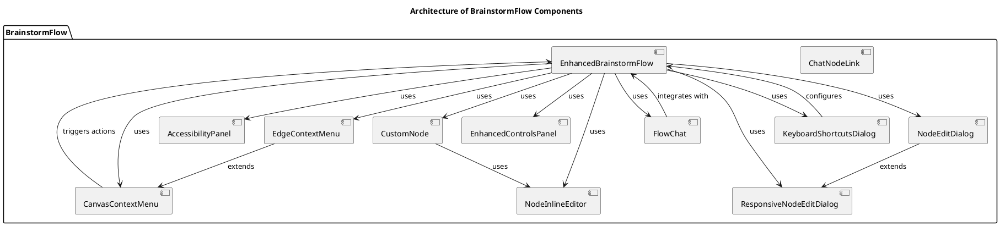

# Architure Brainflow

```plantuml

@startuml
title Architecture of BrainstormFlow Components

package "BrainstormFlow" {
    component "AccessibilityPanel"
    component "CanvasContextMenu"
    component "ChatNodeLink"
    component "CustomNode"
    component "EdgeContextMenu"
    component "EnhancedBrainstormFlow"
    component "EnhancedControlsPanel"
    component "FlowChat"
    component "KeyboardShortcutsDialog"
    component "NodeEditDialog"
    component "NodeInlineEditor"
    component "ResponsiveNodeEditDialog"
    
    EnhancedBrainstormFlow --> AccessibilityPanel : uses
    EnhancedBrainstormFlow --> CanvasContextMenu : uses
    EnhancedBrainstormFlow --> EdgeContextMenu : uses
    EnhancedBrainstormFlow --> CustomNode : uses
    EnhancedBrainstormFlow --> FlowChat : uses
    EnhancedBrainstormFlow --> NodeEditDialog : uses
    EnhancedBrainstormFlow --> NodeInlineEditor : uses
    EnhancedBrainstormFlow --> ResponsiveNodeEditDialog : uses
    EnhancedBrainstormFlow --> EnhancedControlsPanel : uses
    EnhancedBrainstormFlow --> KeyboardShortcutsDialog : uses
    
    CustomNode --> NodeInlineEditor : uses
    NodeEditDialog --> ResponsiveNodeEditDialog : extends
    EdgeContextMenu --> CanvasContextMenu : extends
    CanvasContextMenu --> EnhancedBrainstormFlow : triggers actions
    KeyboardShortcutsDialog --> EnhancedBrainstormFlow : configures
    FlowChat --> EnhancedBrainstormFlow : integrates with
}

@enduml
```