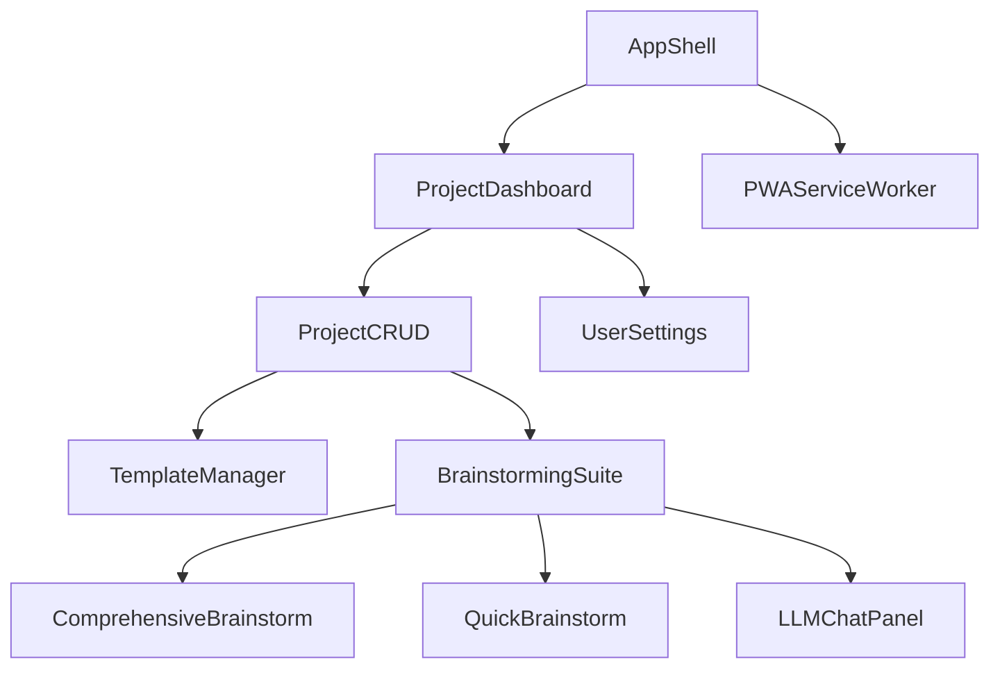

# CRUD Project Manager – Brainstorming UI Redesign (v3)

## 1. Overview

This plan details the implementation of a modern, template-driven CRUD project management app. It supports comprehensive and rapid brainstorming, LLM chat integration, and is designed as a fully responsive Progressive Web App (PWA).

---

## 2. Core Features

- **CRUD Project Management**: Create, read, update, and delete projects using customizable templates.
- **Template System**: Users can select, customize, and save templates for different project types.
- **Comprehensive Brainstorming**: Each project includes a dedicated brainstorming session with visual tools.
- **Quick Brainstorming Tool**: Rapid idea capture and structuring for fast sessions.
- **LLM Chat Integration**: Optional AI-powered chat for deeper insights and ideation.
- **PWA & Responsive Design**: Mobile-first, offline-capable, installable, and accessible.

---

## 3. Component Architecture

---

## 4. User Flows

### 4.1 Project Lifecycle

1. **Create Project**: Select or customize a template.
2. **Brainstorm**: Use comprehensive or quick brainstorming tools.
3. **(Optional) LLM Chat**: Engage AI for ideation or problem-solving.
4. **CRUD Operations**: Edit, duplicate, or delete projects.
5. **Export/Share**: Download or share project data.

### 4.2 Quick Brainstorm

- One-click access from dashboard or project view.
- Minimal UI for rapid idea entry.
- Option to convert quick brainstorm into a full session.

---

## 5. PWA & Accessibility

- **Responsive Layout**: CSS Grid/Flexbox, container queries.
- **Offline Support**: Service Worker caching, local storage fallback.
- **Installable**: Manifest.json, home screen prompts.
- **Accessibility**: WCAG 2.1 AA, ARIA roles, keyboard navigation, color contrast.

---

## 6. Integration Points

- **Template API**: Import/export templates, versioning.
- **LLM API**: Secure, rate-limited chat endpoint.
- **Collaboration**: Real-time sync (WebSockets/CRDTs).

---

## 7. Testing & Quality

| Test Type          | Tools                  | Metrics                  |
|--------------------|------------------------|--------------------------|
| Visual Regression  | Chromatic + Playwright | 100% component coverage  |
| Load Testing       | K6                     | 10k projects/sec         |
| Accessibility      | Axe + VoiceOver        | WCAG 2.1 AA compliance   |
| E2E Flows          | Cypress                | Critical path coverage   |

---

## 8. Roadmap

**Phase 1: Foundation**
- Remove legacy code, implement new store, set up monorepo.

**Phase 2: Core Features**
- CRUD engine, template manager, brainstorming suite, LLM chat.

**Phase 3: PWA & Polish**
- Service worker, offline mode, accessibility, motion design.

---

## 9. Next Steps

1. Execute Phase 1 code removal (3 days)
2. Implement CRUD and template foundation (5 days)
3. Build brainstorming and LLM modules (7 days)
4. PWA and accessibility enhancements (4 days)
5. Write migration and user guides